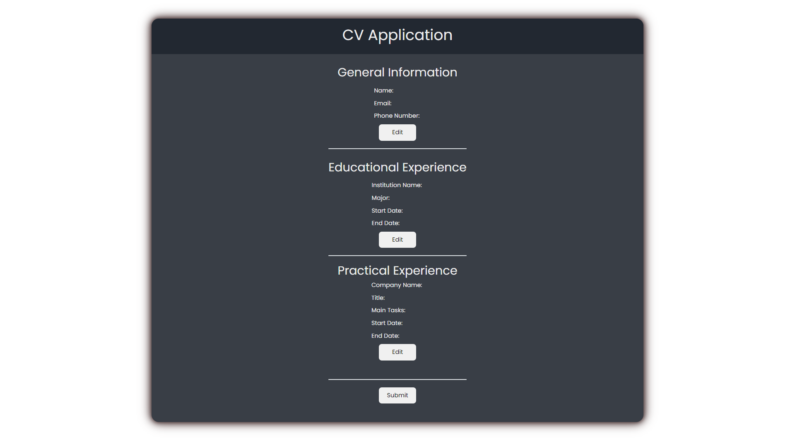
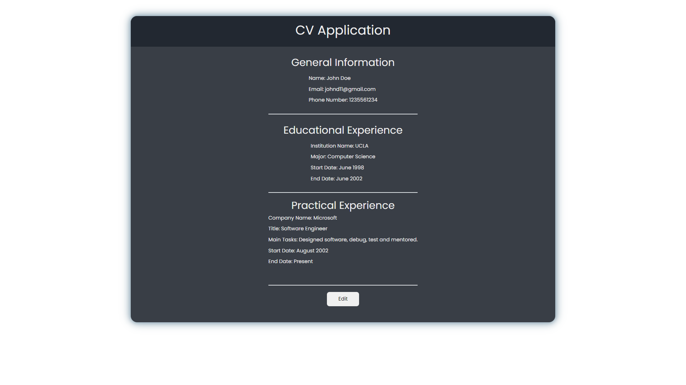

# CV Project
This is a CV project built using React. The project allows you to add and display general information, educational experience, and practical experience in a structured manner.

## Technologies Used
- ReactJS
- HTML
- CSS
- JSX
- BootStrap

## Getting Started
To get started with the project, follow these steps:

- Clone the repository: git clone <https://github.com/bilele123123/cv-application.git>
- Install the dependencies: npm install
- Start the development server: npm start
- Open the project in your browser at http://localhost:3000

## Usage
- Fill in the input fields in each section to provide your information.
- Click the Submit button to display the entered values as HTML elements.
- To make edits, click the Edit button, which will display the input fields with the previously entered information as values. Make your edits and click Submit again.

## Live Demo
<https://bilele123123.github.io/cv-application/>

